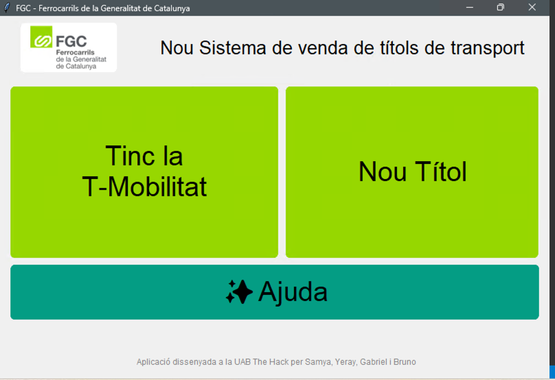
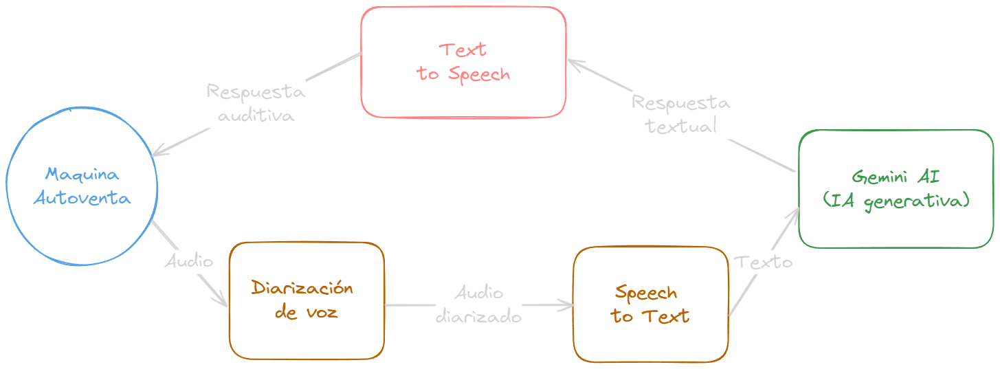

# UAB The Hack - FGC
Aplicación creada para resolver el reto de Ferrocarrils de la Generalitat de Catalunya en la Hack de la UAB 2024. 
El reto consiste en mejorar la inclusividad de personas vulnerables en el transporte público.

## Introducción
La aplicación se compone de dos partes: una aplicación para las maquinas autoventa de billetes y un servicio en la nube que se encarga de gestionar los datos de los usuarios y atenderlos usando IA generativa.

Este repositorio contiene el código de la aplicación en la nube y un esbozo de la aplicación para las maquinas autoventa.

## Instalación
Para la instalación de la aplicación, se deben seguir los siguientes pasos:

### Cloud
Para instalar las dependencias del proyecto, ejecuta el siguiente comando:
```
fastapi dev ./src/cloud/main.py
```

### Máquinas autoventa
Para poder ejecutar la interfaz gráfica se tiene que que usar el comando 'python main.py'.
El menu principal deberia aparecer de esta manera:


## Explicación
El usuario puede acceder a la aplicación a través de la máquina autoventa. Con una interfaz muy sencilla, el usuario puede seleccionar el trayecto que desea realizar y el tipo de billete que necesita. La máquina autoventa se encarga de enviar los datos a la aplicación en la nube, que se encarga de gestionar los datos de los usuarios y atenderlos usando IA generativa.

En caso que el usuario no sepa utilizar la máquina autoventa, puede pedir ayuda a través de la IA generativa. La IA generativa se encarga de guiar al usuario en el proceso de compra del billete.

La maquina contactara con un servidor en la nube enviando los datos del usuario y las opciones seleccionadas, asi como un audio del usuario si este necesita ayuda.

El servidor procesara el audio y enviara una respuesta al usuario con las instrucciones necesarias para completar la compra.

En el siguiente esquema se muestra el flujo de la aplicación:




### Diarización de voz
Para la diarización de voz, se ha utilizado la librería `pyannote.audio`. Esta librería permite realizar la diarización de voz de forma sencilla y eficiente. Recorta el audio en segmentos de la persona mas relevante y envia el audio resultante a un Speech-to-Text para obtener el texto de la conversación.

### Speech-to-Text
Para la conversión de voz a texto, se ha utilizado la librería `speech_recognition`. Esta librería permite convertir la voz en texto de forma sencilla y eficiente. La conversión de voz a texto se realiza usando el servicio de Google Cloud Text-to-Speech.

### Generación de respuestas usando Gemini AI

Para la generación de respuestas, se ha utilizado el servicio de Gemini AI. Este LLM (Large Language Model) permite generar respuestas de forma sencilla y eficiente. Se le ha dado al LLM la información necesaria para poder guiar al usuario en el proceso de compra del billete, y el LLM se encarga de generar las respuestas y preguntas necesarias para completar la compra.

Esto permite una conversación por voz natural y fluida, que ayuda al usuario a completar la compra de forma sencilla y eficiente. Este llm, tiene herramientas que le permiten acceder a los datos de FGC para ayudar en la compra de billetes, y se comunica con la maquina autoventa para ir actualizando la interfaz de usuario.


### Text-to-Speech
Para la conversión de texto a voz, se ha utilizado el servicio de Google Cloud Platform. Este servicio permite convertir texto en voz de forma sencilla y eficiente.

## Autores
La lista de autores de este proyecto es la siguiente:
- Yeray Cordero
- Bruno Moya
- Samya Karzazi
- Gabriel Juan

